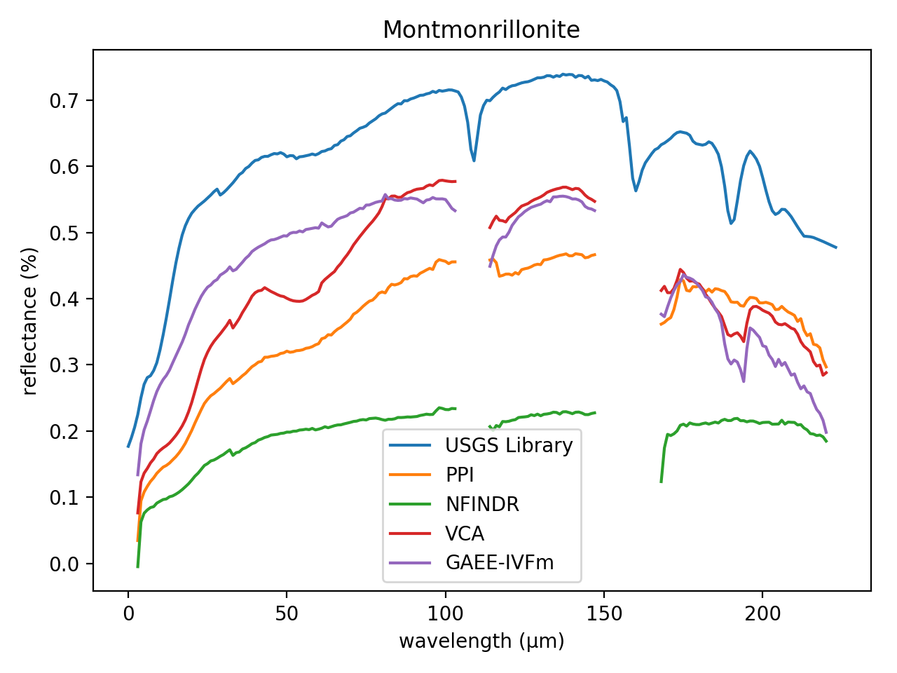

# Comparison of Vertex Componet Analysis (VCA) and Genetic Algorithm Endmember Extraction (GAEE) algorithms for Endmember Extraction

## Douglas Winston R. S., Gustavo T. Laureano, Celso G. Camilo Jr.

Endmember Extraction is a critical step in hyperspectral image analysis and classification. It is an useful method to decompose a mixed spectrum into a collection of spectra and their corresponding proportions. In this paper, we solve a linear endmember extraction problem as an evolutionary optimization task, maximizing the Simplex Volume in the endmember space. We propose a standard genetic algorithm and a variation with In Vitro Fertilization module (IVFm) to find the best solutions and compare the results with the state-of-art Vertex Component Analysis (VCA) method and the traditional algorithms Pixel Purity Index (PPI) and N-FINDR. The experimental results on real and synthetic hyperspectral data confirms the overcome in performance and accuracy of the proposed approaches over the mentioned algorithms.

Paper Online in https://arxiv.org/abs/1805.10644

```
@ARTICLE{2018arXiv180510644D,
   author = {{Douglas Winston.~R.}, S. and {Laureano}, G.~T. and {Camilo}, Jr, C.~G.
	},
    title = "{Comparison of VCA and GAEE algorithms for Endmember Extraction}",
  journal = {ArXiv e-prints},
archivePrefix = "arXiv",
   eprint = {1805.10644},
 keywords = {Computer Science - Neural and Evolutionary Computing, Electrical Engineering and Systems Science - Image and Video Processing, 68T20, 68U10},
     year = 2018,
    month = may,
   adsurl = {http://adsabs.harvard.edu/abs/2018arXiv180510644D},
  adsnote = {Provided by the SAO/NASA Astrophysics Data System}
}
```

**Envirionment Setup:**

Monte Carlo runs: 50 

Number of endmembers to estimate: 12 

Number of skewers (PPI): 1000 

Maximum number of iterations (N-FINDR): 36 

### Parameters used in each GAEE versions

| Parameters            |   GAEE |   GAEE-IVFm |   GAEE-VCA |   GAEE-IVFm-VCA |
|:----------------------|-------:|------------:|-----------:|----------------:|
| Population Size       |  100   |       100   |     100    |           100   |
| Number of Generations | 1000   |      1000   |    1000    |          1000   |
| Crossover Probability |    1   |         0.7 |       0.5  |             1   |
| Mutation Probability  |    0.1 |         0.3 |       0.05 |             0.1 |


### Comparison between the ground-truth Laboratory Reflectances and extracted endmembers using PPI, N-FINDR, VCA, GAEE, GAEE-IVFm using SAM for the Cuprite Dataset.

| Endmembers       |    PPI |   NFINDR |    VCA |   GAEE |   GAEE-IVFm |   GAEE-VCA |   GAEE-IVFm-VCA |
|:-----------------|-------:|---------:|-------:|-------:|------------:|-----------:|----------------:|
| Alunite          | 0.3744 |   0.1122 | **0.0939** | 0.1122 |      0.1034 |     0.1043 |          0.1043 |
| Andradite        | 0.0758 |   0.2068 | 0.1034 | **0.0693** |      0.0760 |     0.1694 |          0.1694 |
| Buddingtonite    | 0.2081 |   0.1205 | 0.0786 | 0.0798 |      **0.0762** |     **0.0762** |          **0.0762** |
| Dumortierite     | 0.1907 |   0.0706 | **0.0702** | 0.0735 |      0.0719 |     0.0755 |          0.0755 |
| Kaolinite_1      | **0.0795** |   0.0870 | 0.0862 | 0.0952 |      0.0935 |     0.0870 |          0.0870 |
| Kaolinite_2      | 0.0820 |   0.0992 | 0.0741 | **0.0649** |      0.0723 |     0.0744 |          0.0782 |
| Muscovite        | 0.2506 |   0.0961 | 0.1805 | **0.0861** |      0.1091 |     0.0965 |          0.0961 |
| Montmonrillonite | 0.1338 |   **0.0646** | 0.0651 | 0.0671 |      0.0677 |     0.0688 |          0.0650 |
| Nontronite       | 0.1033 |   0.0780 | 0.0801 | **0.0711** |      0.0791 |     0.1150 |          0.1150 |
| Pyrope           | 0.0579 |   0.0865 | 0.0818 | **0.0563** |      0.0623 |     0.0793 |          0.0686 |
| Sphene           | 0.0673 |   0.0542 | **0.0530** | 0.1121 |      0.0946 |     0.0795 |          0.0901 |
| Chalcedony       | 0.0871 |   **0.0731** | 0.0773 | 0.0738 |      0.0756 |     0.0765 |          0.0861 |

### SAM Statistics for Cuprite Dataset. 

| Statistics   |      PPI |   NFINDR |    VCA |   GAEE |   GAEE-IVFm |   GAEE-VCA |   GAEE-IVFm-VCA |
|:-------------|---------:|---------:|-------:|-------:|------------:|-----------:|----------------:|
| _Mean_       |   0.1425 |   0.1033 | 0.1024 | 0.1016 |      **0.0989** |     0.1109 |          0.1090 |
| _Std_        |   **0.0000** |   0.0225 | 0.0252 | 0.0248 |      0.0255 |     0.0117 |          0.0157 |
| _p-value_    | -34.8557 |  **-0.6562** | 0.0000 | 0.5032 |      2.3017 |    -6.4153 |         -4.8551 |
| Gain         |  30.6303 |   4.2790 | 3.3962 | 2.6854 |      **0.0000** |    10.8064 |          9.2929 |
| _Time_       |   2.1929 |   7.8318 | **0.5106** | 8.9232 |     22.3329 |     8.7494 |         22.1761 |

### Comparison between the ground-truth Laboratory Reflectances and extracted endmembers using PPI, N-FINDR, VCA, GAEE, GAEE-IVFm using SID for the Cuprite Dataset.

| Endmembers       |    PPI |   NFINDR |    VCA |   GAEE |   GAEE-IVFm |   GAEE-VCA |   GAEE-IVFm-VCA |
|:-----------------|-------:|---------:|-------:|-------:|------------:|-----------:|----------------:|
| Alunite          | **0.0000** |   **0.0000** | 0.0105 | 0.0170 |      **0.0000** |     **0.0000** |          0.0145 |
| Andradite        | **0.0000** |   0.0117 | 0.0052 | 0.0055 |      0.0092 |     0.0077 |          0.0056 |
| Buddingtonite    | 0.0477 |   0.0196 | 0.0077 | 0.0076 |      0.0108 |     **0.0072** |          **0.0072** |
| Dumortierite     | 0.0562 |   **0.0071** | 0.0298 | 0.0072 |      0.0181 |     0.0077 |          0.0077 |
| Kaolinite_1      | 0.0114 |   **0.0104** | 0.0139 | 0.0139 |      0.0128 |     0.0131 |          0.0131 |
| Kaolinite_2      | 0.0114 |   0.0058 | 0.0042 | 0.0049 |      **0.0029** |     0.0111 |          0.0086 |
| Muscovite        | 0.0969 |   0.0317 | 0.0148 | **0.0086** |      0.0286 |     0.0285 |          0.0171 |
| Montmonrillonite | 0.0230 |   0.0053 | **0.0047** | 0.0052 |      0.0048 |     0.0057 |          0.0060 |
| Nontronite       | 0.0126 |   0.0083 | 0.0093 | **0.0065** |      0.0082 |     0.0155 |          0.0155 |
| Pyrope           | 0.0071 |   0.0438 | 0.0229 | **0.0057** |      0.0279 |     0.0593 |          0.0593 |
| Sphene           | 0.0076 |   0.0912 | 0.0096 | 0.0165 |      0.0086 |     0.0099 |          **0.0067** |
| Chalcedony       | 0.0088 |   0.0093 | **0.0069** | **0.0069** |      0.0096 |     0.0070 |          0.0070 |

### SID Statistics for Cuprite Dataset. 

| Statistics   |     PPI |   NFINDR |    VCA |   GAEE |   GAEE-IVFm |   GAEE-VCA |   GAEE-IVFm-VCA |
|:-------------|--------:|---------:|-------:|-------:|------------:|-----------:|----------------:|
| _Mean_       |  0.0236 |   0.0257 | 0.0197 | **0.0163** |      0.0194 |     0.0265 |          0.0268 |
| _Std_        |  **0.0000** |   0.0064 | 0.0107 | 0.0099 |      0.0097 |     0.0065 |          0.0059 |
| _p-value_    | **-5.2271** |  -7.2962 | 0.0000 | 3.8716 |      0.3603 |    -7.4272 |         -8.2866 |
| Gain         | 28.7161 |   1.6376 | 0.7304 | 0.0000 |     **-2.7595** |     8.3452 |          6.7899 |
| _Time_       |  2.1929 |   7.8318 | **0.5106** | 8.9232 |     22.3329 |     8.7494 |         22.1761 |





